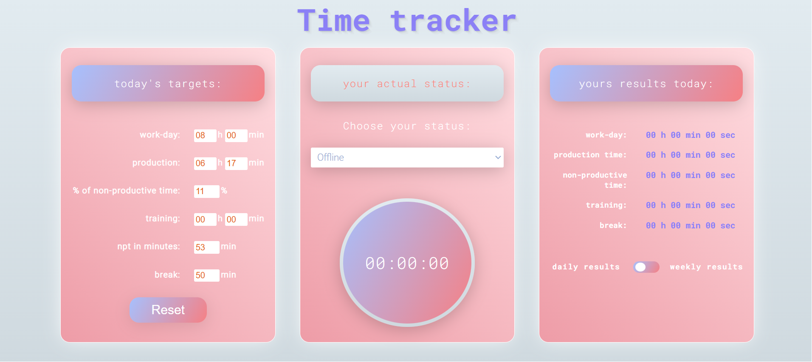
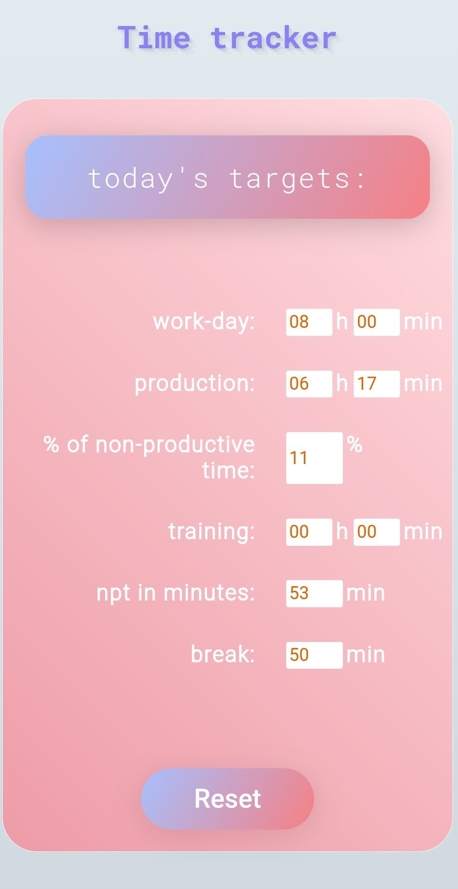
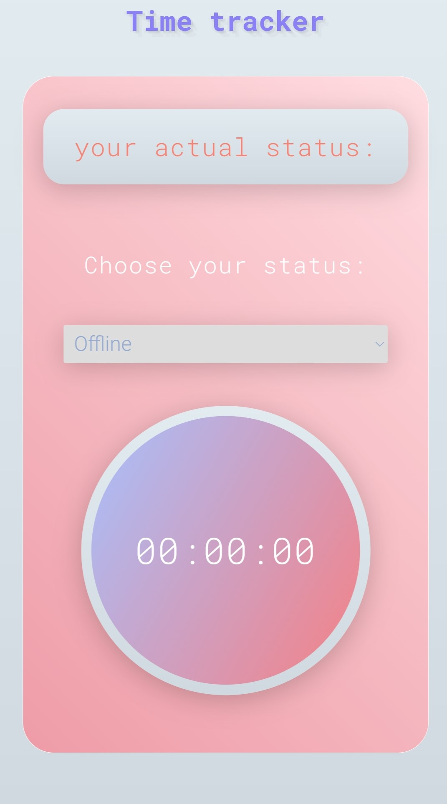
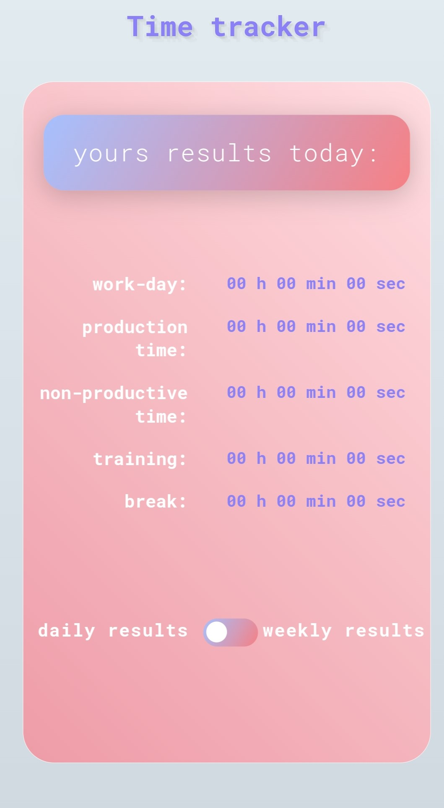

# Time tracker app

## General Information

- Time tracker is an application which allows you to set daily targets and monitor how you are doing in real time
- Application contains three segments:

1. Today's targets: 
- the application calculates daily targets of:
* planned production time, based on % of NPT available for user and based on the planned training time

* based on the given % of NPT (Non-Productive Time), the application also calculates the NPT in minutes including the planned training

EXAMPLE: You are full-time employee with 8-hour shift (40 hours per week). At work your manager asked you to not exceed 11% of NPT. Every employee has a right to the 50 minutes of break, the rest of the time you should spend on production. The calculator allows you to evaluate the exact values of production time you should spend on, as well as it helps you to transform the  percent of NPT for the values of NPT in minutes. 

2. Your actual status:
- in this section, you select the appropriate status for your current activity, and the clock counts down the time spent on that status

3. Yours daily and weekly results:
- this application's section aims at user controlling and monitoring their daily and weekly targets;
- user can compare the targets set for a given day with the results that have been achived at the moment 
- the weekly results tab allows to the user to view the metrics in the context of the whole week

## Installation

- Since this project was created in pure vanilla JS, it works in web browser. It means you don't need to install any extra tools to run this app. 

## Motivation and problems encountered

- Motivation: constantly changing targets for various tasks at work motivated me to create a tool that will accurately calculate these targets. The application improves the organization of work and also allows you to save time comparing to the manual calculation of these targets. In addition, the tool is equipped with a time counter, thanks that you can control the time spent on individual tasks and you can compare your's goals with the results you have already achieved during the day and throughout the week.

- Challenge 1: stopwatch: based on the setInterval concept, I created startStopwatch function, responsible for starting the stopwatch. The clock starts every time you change the status (except for the offline status - which made the clock disabled). The displayTime function is responsible for displaying the actual time in application.

- Challenge2: how to store the results reflecting the time spent on the appropriate statuses and then display them in the daily results section?

* I created an object called state which, among others, stores arrays with informations about how much time you spent on a given status. This object is updated every time you change status. After proper ordering and conversion of the values, thanks to the updateResults function, the appropriate values are displayed in the 'yours results today' section.

- Challenge3: how to retrieve the results spent on the given statuses from several days? How to store them, how to sum them up in order to display them in the weekly results section?

* to display the results for the whole week, I used two tools:

  - Cloud Firestore - a tool for storing data on the server. After clicking on the offline status, the data is downloaded to the server using the add method. Thanks to the onSnapshot method those results are stored in snapshot document and downloaded from the server. Every time new data are entered to the server, the snapchot document is also updated. The data retrieved from the server is stored in the array called history. The reduce method calculates the data for each status separatly within the week. Thanks that (after ordering and conversion), when you click on the 'weekly results' tab, you can see the results of work for the entire week
    
  - date-fns library - allows you to set the time frame for storing data in the Firestore Database in order to display this data correctly in the 'Weekly results' tab. In my project we store data for the whole week, where the first day is monday.

## Technologies Used

- Html - version 5
- Css - version 3
- JavaScript - version 1.7

## Screenshots

  Web version
  

  Mobile version
  

## Live demo

Click [_here_](https://time-tracker-appli.netlify.app/).

